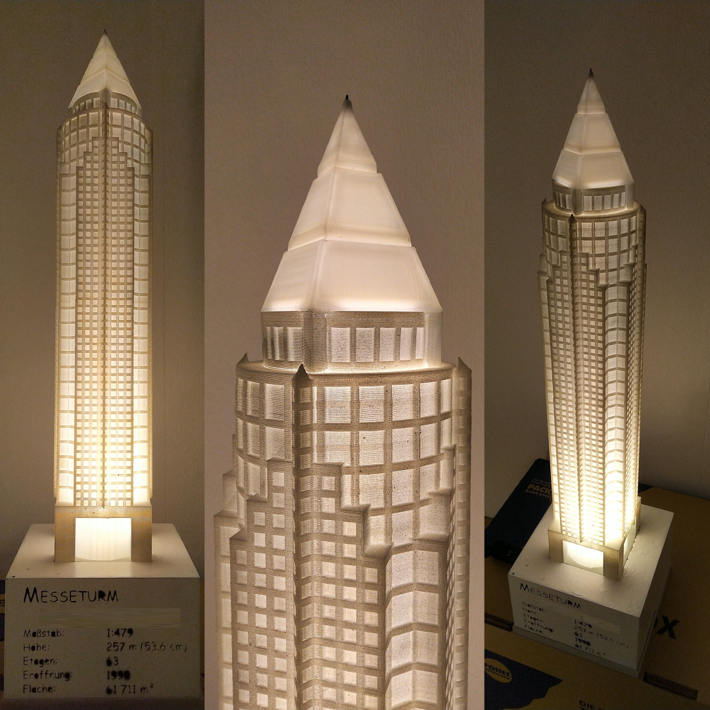
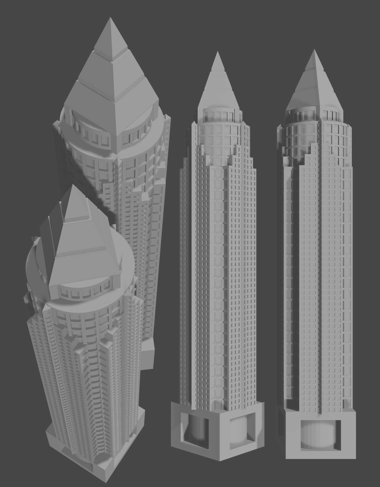

# Messeturm

Model of Frankfurt's [Messeturm](https://en.wikipedia.org/wiki/Messeturm) (translates to Trade Fair Tower).





The model includes a socket that fits a GU 10 led lamp.
The model is to be printed at 1000% scale, thus that the main tower reaches 44 cm in height.
The stand has holes to be filled with concrete or some other heavy material. 
One part of the stand has to be mirrored either on x-axis or in y-axis so that both parts fit together.

## Print Settings
To print the 44 cm tall main tower, your printer needs to be extended vertically.
To disable limits on a modified Ender 3 prepend the following gcode to the print gcode file:
```gcode
M117 Homing all axes
G28 ; home axes
M211 S0 ; turn off Marlin's software endstops
M117 Disabled endstops 
```
Alternatively, you can split the tower in two parts, e.g. if you notice too much swaying during printing.

Other settings:
- Tower:
	- infill: grid, 7%
	- layer height: 0.32 mm, base layer 0.2 mm
	- support: concentric, density: 10%
	- adhesion: brim
	- scale: 1000%

